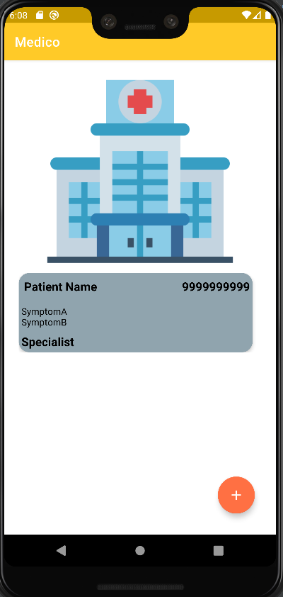
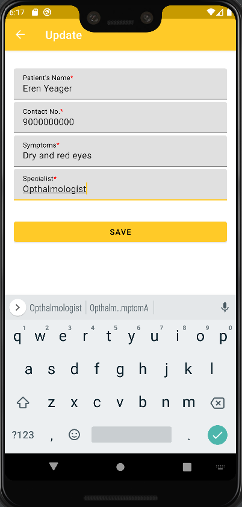
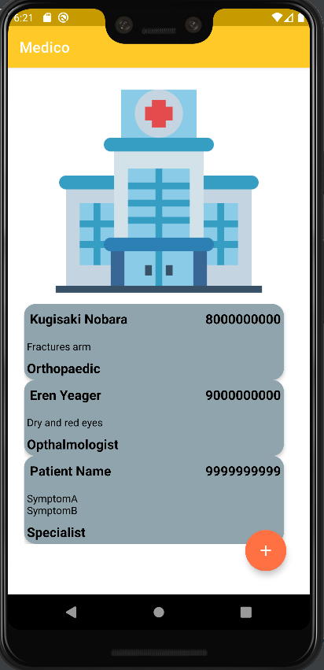
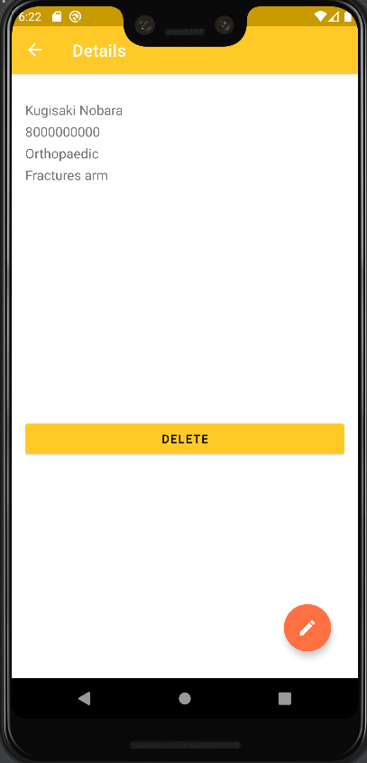
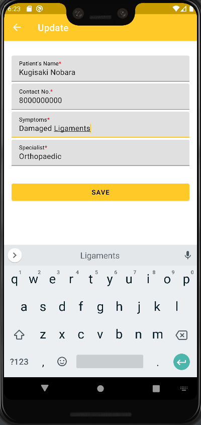
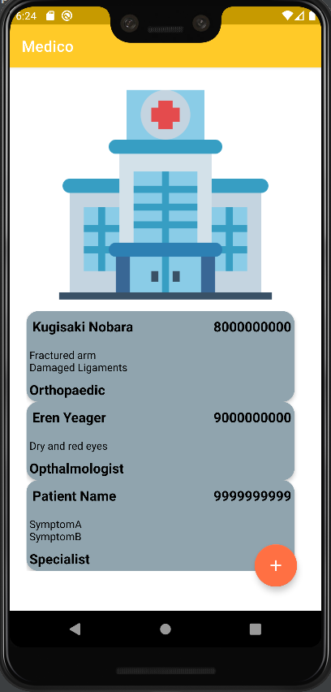
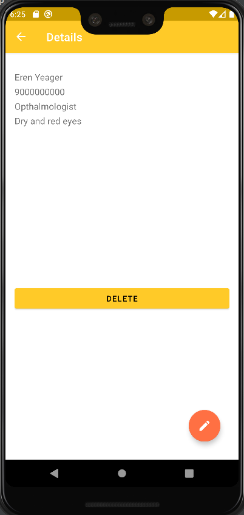
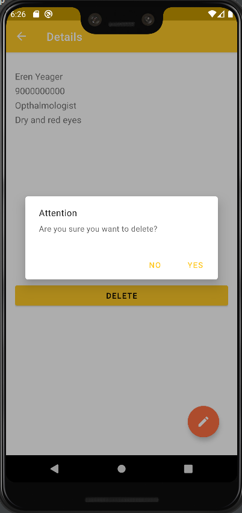
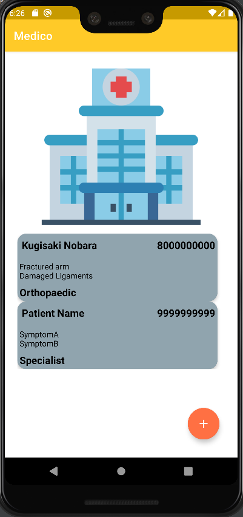

# Hack36

Healthcare App

<b> Problem Statement: </b>

1. To maintain record of patients as well as taking them to their respective doctors is a difficult task for hospitals. 
2. Also, in remote areas where doctors are not easily accesible, the problems faced by the patients does not reach doctor.

<b> Proposed Solution : </b>

As smartphones are widely used today, an android application solves the purpose significantly. The app can be used to gather data about the name of patient, contact no., symptoms or uneasiness felt and specialist to be consulted.
Refer to the images for working of the application:

 

 

 

<b> Installation : </b>

Use the given APK link to install the application on phone:
https://drive.google.com/file/d/1dYMi9AbDe4UV5VH_qChjj4x9TMeQ7m6H/view?usp=sharing

OR
1. Download from github link: https://github.com/maitri-23/Medico
2. Install Android Studio: https://developer.android.com/studio
3. Connect android studio with android emulator(android phone or virtual device)
4. Run the project on android studio.

<b> Future Scope and Improvements : </b>

More features can be added to app by connecting it to a server like user login and registration, dashboard for the user, filter the cases according to the specialist, payment features. The further developed app can then be deployed on the playstore.